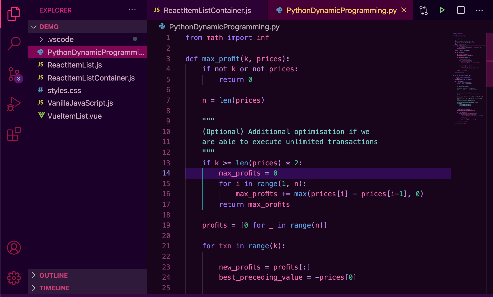

# Werewolf

Werewolf is a dark, neo-noir Visual Studio Code (VSCode) theme inspired by Telltale's _The Wolf Among Us_.

## Examples

### React / JavaScript

### Python

## Usage

With VSCode up and running,
- Open up the __Extensions__ view in the activity bar
- Search for an extension by the name of "Werewolf"
- Click on the extension, __Install__ it, and then select __Set Color Theme__

## Feedback

Having some trouble? [Create an issue](https://github.com/yaaooo/werewolf-vscode-theme/issues/new/choose) and I'll look into your problem.

Wish to fix something yourself or add a spin on the theme? Check out the [contributing guidelines](CONTRIBUTING.md).

## Credits

Illustrations wonderfully crafted by [Natalie Christian Tan](https://nataliechristiantan.com/work).

[Sarah Drasner's article on CSS Tricks](https://css-tricks.com/creating-a-vs-code-theme/) was a valuable resource for getting me started. It also provided me with perspective on design decisions on topics such as managing contrast (though in this theme's case I took plenty of liberties).

Last but not least, kudos to the Telltale team for putting together [this memorable series](https://www.youtube.com/watch?v=_htfCzTjCpA) — and of course, the creators of _Fables_ for inspiring them in the first place.

## License

[MIT License](LICENSE)